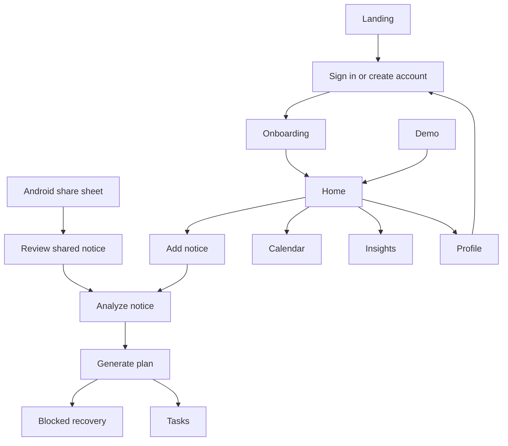

---
tags:
  - secondbrain
  - documentation
---
# Screen Flow

## Active Routes

| Route            | Purpose                                                         |
| ---------------- | --------------------------------------------------------------- |
| `/`              | DeadlineOS landing page and demo entry                          |
| `/onboarding`    | Eight-step preference setup                                     |
| `/home`          | Dashboard and next-deadline overview                            |
| `/add`           | Select notice source and enter text                             |
| `/share`         | Review shared text, a URL, PDF, or screenshot before extraction |
| `/auth/callback` | Complete Google or email-confirmation sign-in safely            |
| `/analysis/[id]` | Simulated notice analysis and plan review                       |
| `/deadline/[id]` | Task plan and completion controls                               |
| `/blocked/[id]`  | Blocker recovery plan                                           |
| `/tasks`         | All tasks with status filters                                   |
| `/calendar`      | Deadline month view                                             |
| `/insights`      | Progress overview                                               |
| `/profile`       | Demo data and preference controls                               |

## Main Flow

