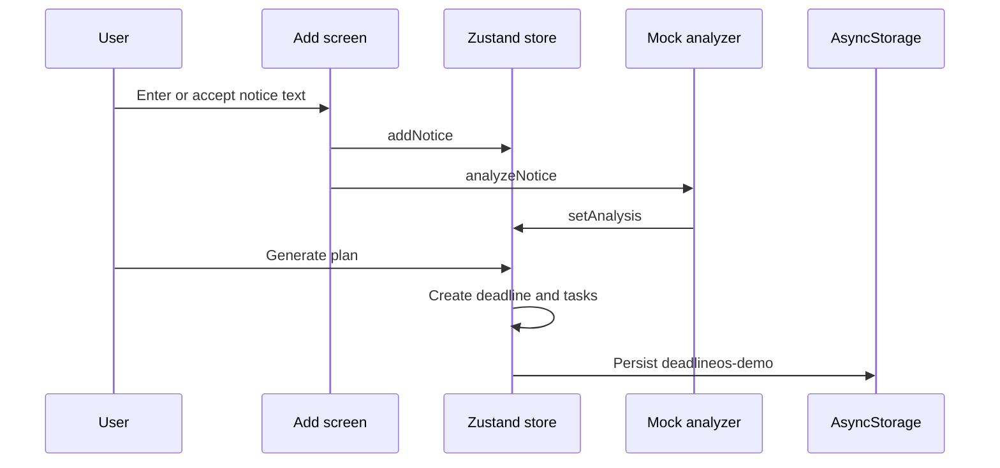

# Data Flow

## Simple Explanation

The app keeps its demo notebook on the device. When a user enters a notice, the app reads the text with predictable demo rules, makes a deadline and small tasks, then saves all of that locally.

## Main Flow

## Authentication

- Supabase Auth manages the user identity and issued session.
- The session is persisted on device with Expo SecureStore and refreshed while the app is active.
- Expo Router blocks all DeadlineOS routes until a valid session exists.
- Google sign-in opens the system browser, returns through `anapp://auth/callback`, and exchanges the returned authorization code for the same Supabase session.

## Storage

- Storage: AsyncStorage.
- Key: `deadlineos-demo`.
- Entities: profile, notices, analyses, deadlines, and tasks.
- No remote DeadlineOS database or real notification scheduling is implemented yet.
