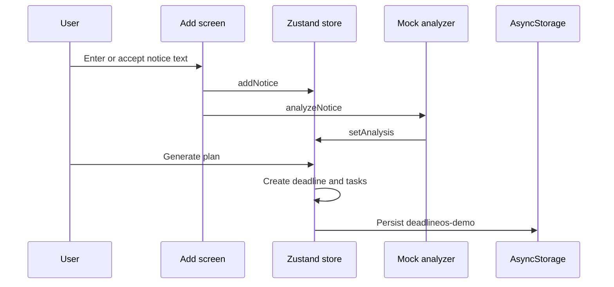

# Data Flow

## Simple Explanation

The app keeps its demo notebook on the device. When a user enters a notice, the app reads the text with predictable demo rules, makes a deadline and small tasks, then saves all of that locally.

## Main Flow

## Authentication

- Supabase Auth manages the user identity and issued session.
- The session is persisted on device with Expo SecureStore and refreshed while the app is active.
- Expo Router blocks all DeadlineOS routes until a valid session exists.
- Google sign-in returns through `anapp://auth/callback`. Email confirmation uses the same route only when it is enabled in Supabase. With Confirm Email disabled, email sign-up returns a session immediately and opens onboarding or Home without a confirmation link.
- The callback checks an existing device session first. An old or incomplete deep link cannot block a user who is already signed in; a signed-out user with an expired link receives a clear error.

## Storage

- Storage: AsyncStorage.
- Key: `deadlineos-demo`.
- Entities: profile, notices, analyses, deadlines, and tasks.
- No remote DeadlineOS database or real notification scheduling is implemented yet.

## Live Notice Analysis (Hackathon Path)

Live text, PDF, and screenshot uploads are stored privately under the signed-in user's ID, then a persisted `analysis_jobs` record moves through queued, reading, extracting, planning, and awaiting approval. Gemini returns a validated extraction. The app polls this saved job while open; an error offers Retry and an explicitly selected Demo Mode sample, never a silent substitution.

## Android Shared Notices

Android apps can send one text/URL, PDF, JPG, PNG, or WebP notice to DeadlineOS from their Share sheet. Text is passed directly to private analysis; files are resolved from a temporary URI and checked against the MIME type and 10 MB limit. A cancelled, unsupported, or failed item is never sent to Gemini. If the user is signed out, the payload stays pending through sign-in and returns to the review screen.
