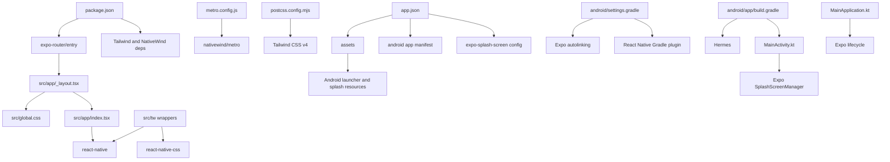

---
tags:
  - secondbrain
  - documentation
---
# Dependency Map

See also [[01-architecture]], [[02-folder-map]], and [[11-important-files]].

## Major Dependencies

| Source                     | Depends On                                                  | Purpose                                     |
| -------------------------- | ----------------------------------------------------------- | ------------------------------------------- |
| `package.json`             | `expo-router/entry`                                         | App entry point                             |
| `src/app/_layout.tsx`      | `expo-router`                                               | Root stack navigation                       |
| `src/app/_layout.tsx`      | `src/global.css`                                            | Loads Tailwind CSS globally                 |
| `src/app/index.tsx`        | `react-native`                                              | Placeholder UI                              |
| `src/tw/*`                 | `react-native-css`, `expo-image`, `react-native-reanimated` | CSS-enabled React Native component wrappers |
| `src/features/auth/*`      | `@supabase/supabase-js`, `expo-secure-store`, `expo-linking`, `expo-web-browser` | Authentication, Google OAuth, session storage, and route access |
| `metro.config.js`          | `nativewind/metro`                                          | NativeWind Metro transform setup            |
| `postcss.config.mjs`       | `@tailwindcss/postcss`                                      | Tailwind v4 CSS processing                  |
| `app.json`                 | DeadlineOS fox assets under `assets/images/`                | Launcher, adaptive icon, splash, and favicon |
| `android/app/src/main/res/` | generated fox PNG launcher and splash density assets        | Current workspace Android branding used by the APK |
| `android/settings.gradle`  | Expo autolinking and React Native Gradle plugin             | Native module linking                       |
| `android/app/build.gradle` | React Native, Hermes/JSC, Android Gradle                    | Android build                               |
| `MainActivity.kt`          | Expo splash screen, React Native activity                   | Android startup                             |
| `MainApplication.kt`       | Expo lifecycle, React Native host                           | Android app lifecycle                       |

## High-Impact Modules

- `package.json`: Changes affect dependency graph, scripts, and app startup.
- `app.json`: Changes affect native config, deep links, icons, splash, and platform behavior.
- `src/app/_layout.tsx`: Changes affect every route.
- `src/global.css` and `src/tw/*`: Changes affect Tailwind/className styling across future screens.
- `android/app/build.gradle`: Changes can break Android builds.
- `android/app/src/main/AndroidManifest.xml`: Changes affect permissions, app entry, and deep links.

## Compatibility Boundary

- The active mobile source must use React Native-compatible libraries.
- `framer-motion` is not an installed dependency and is not used by any active source file. Native animation support is provided by `react-native-reanimated` when required by the CSS wrapper layer.

## Dependency Graph

